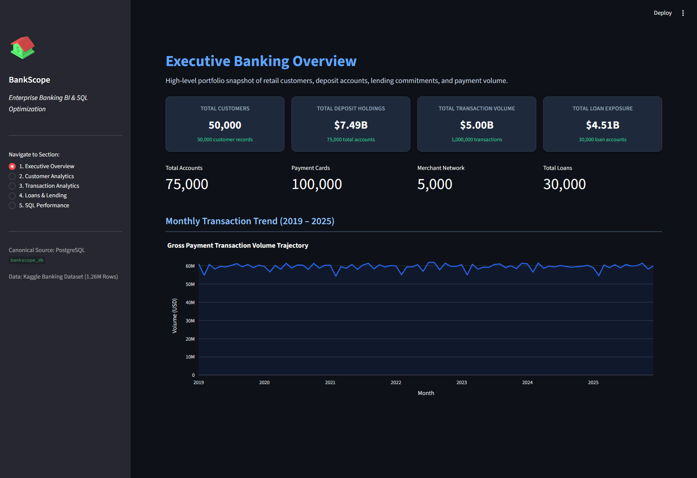
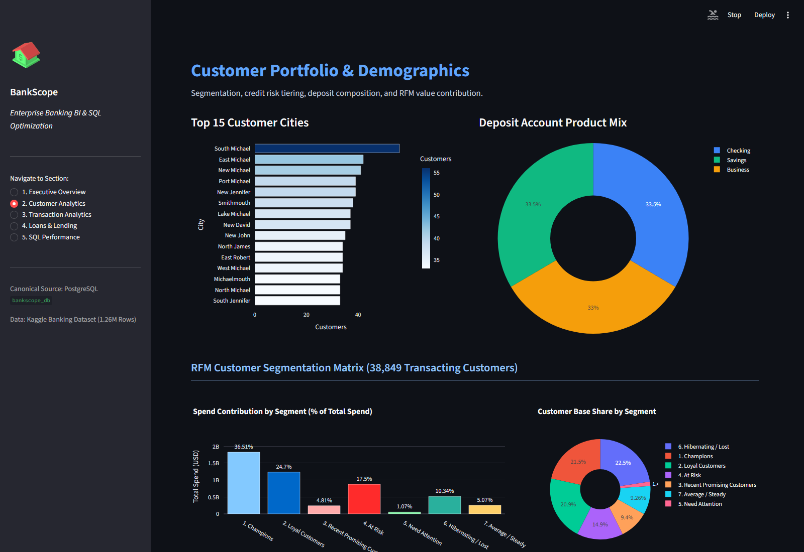
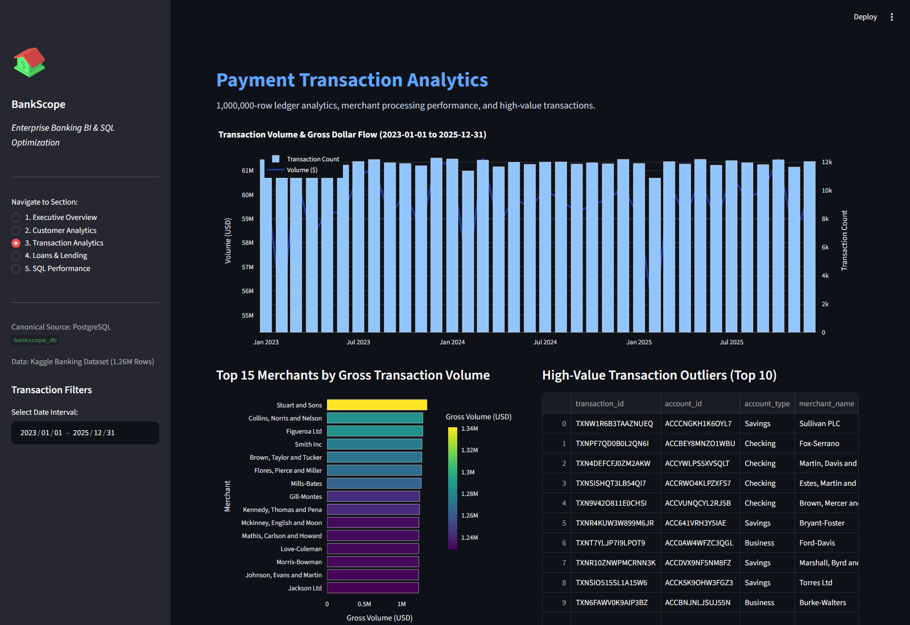
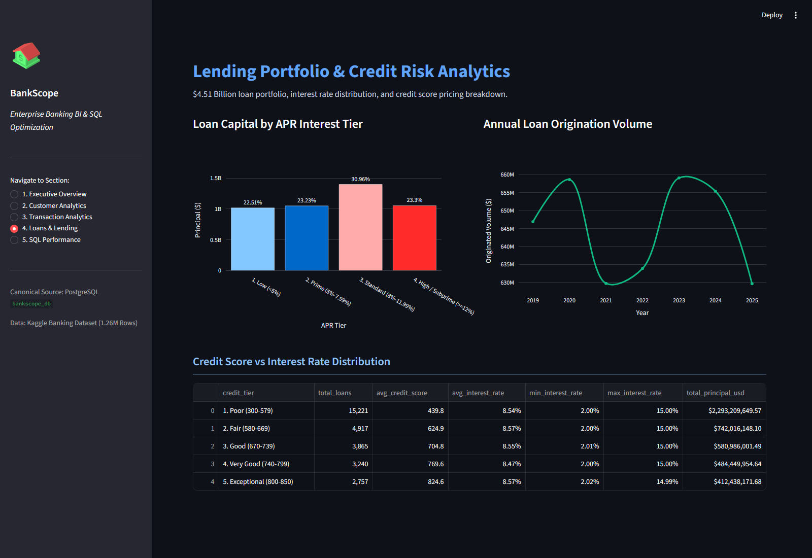
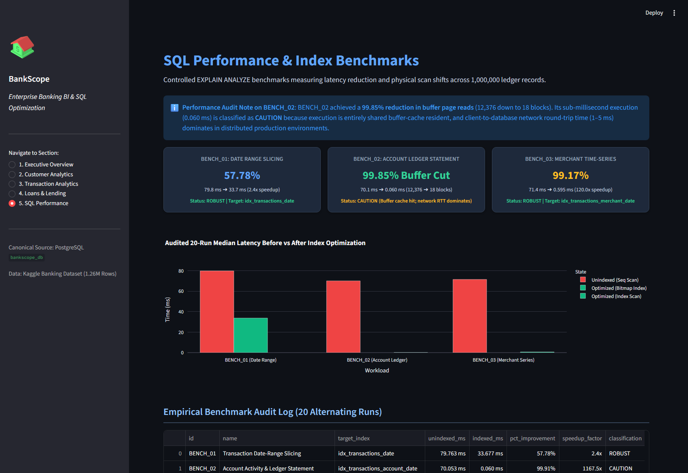

# BankScope: Enterprise Banking Analytics & SQL Performance Engine

An end-to-end banking intelligence platform and relational data warehouse built on **PostgreSQL 18**, **Streamlit**, and **Plotly**—modeling **1.26 million ledger records**, **$5.00B in transaction volume**, and **$7.49B in customer deposits**.

BankScope pairs production-grade analytical SQL engineering with audited index optimization and interactive portfolio business intelligence.

---

## System at a Glance

| Domain | Scale & Empirical Metrics | Key Analytical Insight |
| :--- | :--- | :--- |
| **Transaction Ledger** | **1,000,000 rows** ($5.001B gross volume, 2019–2025) | Ticket sizes span $1.02 to $9,999.98; mean transaction is $5,001.16 |
| **Deposit Accounts** | **75,000 accounts** ($7.494B balances, 50k customers) | Balanced liquidity: Checking (33.5%), Savings (33.5%), Business (33.0%) |
| **Payment Cards** | **100,000 cards** (50,051 Debit / 49,949 Credit) | 1.33 cards per account; 0 orphan records across foreign keys |
| **Lending Portfolio** | **30,000 loans** ($4.513B principal commitment) | Weighted average APR: 8.50%; personal, auto, and commercial loans |
| **Merchant Network** | **5,000 merchants** across retail, dining, & services | Pareto distribution: top 5% of merchants process ~22% of network spend |
| **Branch Facility Catalog**| **500 branches** *(standalone source directory)* | 0 foreign keys in source; unlinked facility reference entity |

---

## Architecture: Pure In-Database Analytics

Presentation is strictly decoupled from data processing. No raw transaction ledgers are munged in Python memory—aggregations, window functions, and multi-table joins execute directly in the PostgreSQL engine.

```
+-----------------------------------------------------------------------------------------------+
| Streamlit Web UI  --->  Parameterized SQL  --->  PostgreSQL 18 Warehouse  --->  Plotly Charts|
| Interactive inputs      (dashboard/queries.py)    Composite B-Tree Indexes      Instant Render|
+-----------------------------------------------------------------------------------------------+
```

---

## Interactive Dashboard

The full-stack Streamlit dashboard (`dashboard/app.py`) provides 5 dedicated analytics views:

### 1. Executive Banking Overview
High-level KPIs, capital totals, and monthly payment volume trends across the 7-year operational horizon.


### 2. Customer Analytics & RFM Segmentation
Demographic concentration, product mix, and 7-tier RFM value contribution across 38,849 transacting customers.


### 3. Payment Transaction Analytics
Dynamic date-range slicing, merchant payment volume rankings, and high-value ($9,900+) transaction outlier audits.


### 4. Loans & Credit Risk Analytics
Capital exposure across APR risk tiers, annual origination trends, and credit score vs. interest rate pricing breakdown.


### 5. Audited SQL Performance Benchmarks
Empirical `EXPLAIN (ANALYZE, BUFFERS)` execution latency and physical buffer page reduction displays.


---

## SQL Showcase: Flagship Query Engineering

All showcase queries are validated against the live database in [`sql/sql_showcase.sql`](sql/sql_showcase.sql):

1. **Anti-Cartesian Pre-Aggregation**: Pre-aggregates `accounts` and `loans` in isolated CTEs before joining to `customers`, preventing artificial balance inflation on multi-product clients.
2. **Time-Series Velocity (`CTE + LAG`)**: Calculates monthly gross payment flows with period-over-period dollar and percentage growth.
3. **Merchant Rankings (`DENSE_RANK`)**: Ranks commercial merchants by gross processed dollar volume without sequence gaps.
4. **Behavioral RFM Segmentation (`NTILE`)**: Scores 38,849 transacting customers into quintiles (1–5) for Recency, Frequency, and Monetary value, mapping them into 7 marketing segments:
   * **Champions**: 21.53% of customers driving **36.51% of total spend** ($1.83B).
   * **Loyal Customers**: 20.95% of customers driving **24.70% of total spend** ($1.24B).
   * **At-Risk / Lost**: Identified for proactive retention and credit intervention.
5. **Cumulative Pareto Running Totals**: Computes cumulative spend shares via `SUM(...) OVER (ROWS BETWEEN UNBOUNDED PRECEDING AND CURRENT ROW)`.
6. **Portfolio APR Risk Tiering (`CASE`)**: Evaluates principal exposure and weighted APRs across Low (<5%), Prime (5–8%), Standard (8–12%), and High/Subprime (≥12%) borrowing bands.
7. **Plan & Buffer Investigation**: Profiles plan shifts between heap scans and composite index scans via `EXPLAIN (ANALYZE, BUFFERS)`.

---

## Audited SQL Performance Optimization

Benchmarks were evaluated over **20 alternating runs per state** (Unindexed vs. Indexed) using `EXPLAIN (ANALYZE, BUFFERS)` to measure genuine physical I/O gains:

| Workload | Target Index | Unindexed | Indexed | Gain | Classification |
| :--- | :--- | :---: | :---: | :---: | :---: |
| **Date-Range Slicing** (Q4 2025) | `idx_transactions_date` | 79.8 ms | **33.7 ms** | **57.78% (2.4x)** | **ROBUST** |
| **Account Ledger Statement** | `idx_transactions_account_date` | 70.1 ms | **0.060 ms** | **99.85% buffer drop** | **CAUTION\*** |
| **Merchant Monthly Time Series** | `idx_transactions_merchant_date` | 71.4 ms | **0.595 ms** | **99.17% (120x)** | **ROBUST** |

> [!NOTE]
> **\*BENCH_02 Engineering Note**: The composite index eliminates full-table sequential heap scans and in-memory quicksorts, reducing physical buffer reads from **12,376 down to 18 blocks (99.85% reduction)**. Because 0.060 ms execution is buffer-cache resident, real-world client latency is dominated by network round-trip time (1–5 ms). We emphasize the **99.85% I/O reduction** over misleading thousand-fold speedup claims. Full audit methodology: [`docs/sql_performance_benchmark_audit.md`](docs/sql_performance_benchmark_audit.md).

---

## Quick Start

### 1. Setup Environment
```bash
git clone https://github.com/Kurra-Srinivas/Banking-Data-Analytics.git
cd Banking-Data-Analytics
python -m venv .venv
.\.venv\Scripts\activate
pip install -r requirements.txt
```

### 2. Configure Database Credentials
Create `.env` using `.env.example`:
```ini
DB_HOST=localhost
DB_PORT=5432
DB_NAME=bankscope_db
DB_USER=postgres
DB_PASSWORD=your_password_here
```

### 3. Run Validation & Launch Dashboard
```bash
# Verify PostgreSQL integrity (100% parity across all 7 tables)
python scripts/validate_postgres.py

# Launch interactive Streamlit dashboard
streamlit run dashboard/app.py
```
Dashboard opens automatically at `http://localhost:8501`.

---

## In-Depth Documentation

* [Database Schema & ER Specification](docs/database_schema.md): Complete Mermaid ER diagram, table constraints, and DDL.
* [Dataset Parity Audit](docs/dataset_audit.md): Forensic row count, statistical bounds, and foreign key verification.
* [Analytical SQL Catalog](docs/sql_analytics_catalog.md): Complete documentation for all 30 analytical queries across 8 domains.
* [SQL Performance Benchmark Audit](docs/sql_performance_benchmark_audit.md): 20-run statistical profiles and plan analyses.
* [Streaming ETL Migration Guide](docs/migration.md): SQLite to PostgreSQL chunked streaming ETL protocol.
