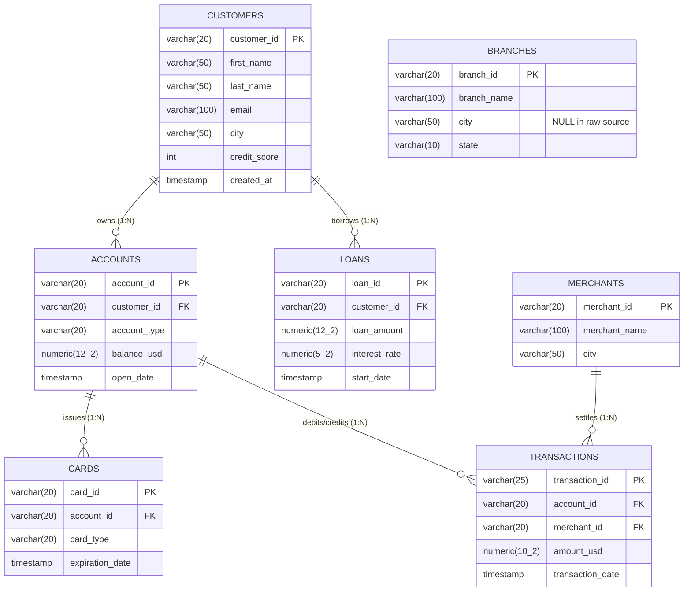

# BankScope — Relational Database Architecture & ER Specification

**Target Database**: PostgreSQL 18.0 (`bankscope_db`)  
**Data Volume**: 1,260,500 total rows across 7 relational tables  
**Canonical Source**: `data/raw/banking_dataset_kaggle/data/database/bank_sqlite.db`  
**Referential Integrity Status**: 100% Verified (Zero orphan records across all foreign keys)

---

## 1. Entity-Relationship (ER) Architecture Diagram

The relational schema strictly reflects verified empirical relationships discovered during forensic auditing. All child entities enforce referential integrity with cascading safeguards.

> [!IMPORTANT]
> **Architectural Boundary Note on `branches`**:
> The `branches` entity contains 500 bank facility records. As established during dataset forensic analysis, the raw dataset provides **zero foreign keys or branch identifiers** connecting `branches` to `accounts`, `customers`, or `transactions`. Furthermore, `branches.city` is 100% NULL in the source data.
>
> To preserve forensic integrity, `branches` is maintained as a **standalone reference table** without artificial or fabricated foreign keys.

---

## 2. Table-by-Table Specifications & DDL Constraints

### 1. `customers` (Customer Master Demographics)
* **Row Count**: 50,000 records
* **Primary Key**: `customer_id` (`VARCHAR(20)`)
* **Indexes**: `idx_customers_city ON customers(city)`

| Column | Data Type | Nullable | Constraints | Description |
| :--- | :--- | :---: | :--- | :--- |
| `customer_id` | `VARCHAR(20)` | NO | `PRIMARY KEY` | Unique customer alphanumeric identifier |
| `first_name` | `VARCHAR(50)` | NO | — | Customer given name |
| `last_name` | `VARCHAR(50)` | NO | — | Customer family name |
| `email` | `VARCHAR(100)` | NO | *(Non-unique in source)* | Contact email address |
| `city` | `VARCHAR(50)` | NO | — | Residential city location |
| `credit_score` | `INTEGER` | NO | `CHECK (credit_score BETWEEN 300 AND 850)` | FICO credit score (range 300–850) |
| `created_at` | `TIMESTAMP` | NO | — | Account profile onboarding timestamp |

---

### 2. `accounts` (Deposit & Checking Ledger)
* **Row Count**: 75,000 records
* **Primary Key**: `account_id` (`VARCHAR(20)`)
* **Foreign Key**: `customer_id REFERENCES customers(customer_id) ON DELETE CASCADE`
* **Indexes**: `idx_accounts_customer_id ON accounts(customer_id)`

| Column | Data Type | Nullable | Constraints | Description |
| :--- | :--- | :---: | :--- | :--- |
| `account_id` | `VARCHAR(20)` | NO | `PRIMARY KEY` | Unique account identifier |
| `customer_id` | `VARCHAR(20)` | NO | `FOREIGN KEY` | Owning customer reference |
| `account_type` | `VARCHAR(20)` | NO | `CHECK (account_type IN ('Checking', 'Savings', 'Business'))` | Account product category |
| `balance_usd` | `NUMERIC(12, 2)` | NO | `CHECK (balance_usd >= 0)` | Current ledger balance in USD |
| `open_date` | `TIMESTAMP` | NO | — | Account opening timestamp |

---

### 3. `cards` (Payment Card Instruments)
* **Row Count**: 100,000 records
* **Primary Key**: `card_id` (`VARCHAR(20)`)
* **Foreign Key**: `account_id REFERENCES accounts(account_id) ON DELETE CASCADE`
* **Indexes**: `idx_cards_account_id ON cards(account_id)`

| Column | Data Type | Nullable | Constraints | Description |
| :--- | :--- | :---: | :--- | :--- |
| `card_id` | `VARCHAR(20)` | NO | `PRIMARY KEY` | Unique card identifier |
| `account_id` | `VARCHAR(20)` | NO | `FOREIGN KEY` | Linked deposit account reference |
| `card_type` | `VARCHAR(20)` | NO | `CHECK (card_type IN ('Debit', 'Credit'))` | Card instrument type |
| `expiration_date`| `TIMESTAMP` | NO | — | Card expiration timestamp |

---

### 4. `loans` (Credit & Lending Commitments)
* **Row Count**: 30,000 records
* **Primary Key**: `loan_id` (`VARCHAR(20)`)
* **Foreign Key**: `customer_id REFERENCES customers(customer_id) ON DELETE CASCADE`
* **Indexes**: `idx_loans_customer_id ON loans(customer_id)`

| Column | Data Type | Nullable | Constraints | Description |
| :--- | :--- | :---: | :--- | :--- |
| `loan_id` | `VARCHAR(20)` | NO | `PRIMARY KEY` | Unique loan contract identifier |
| `customer_id` | `VARCHAR(20)` | NO | `FOREIGN KEY` | Borrower customer reference |
| `loan_amount` | `NUMERIC(12, 2)` | NO | `CHECK (loan_amount > 0)` | Disbursed loan principal amount |
| `interest_rate`| `NUMERIC(5, 2)` | NO | `CHECK (interest_rate >= 0)` | Annual percentage rate (APR) |
| `start_date` | `TIMESTAMP` | NO | — | Loan origination date |

---

### 5. `merchants` (Commercial Merchant Network)
* **Row Count**: 5,000 records
* **Primary Key**: `merchant_id` (`VARCHAR(20)`)
* **Indexes**: `idx_merchants_city ON merchants(city)`

| Column | Data Type | Nullable | Constraints | Description |
| :--- | :--- | :---: | :--- | :--- |
| `merchant_id` | `VARCHAR(20)` | NO | `PRIMARY KEY` | Unique merchant identifier |
| `merchant_name`| `VARCHAR(100)` | NO | — | Commercial merchant trade name |
| `city` | `VARCHAR(50)` | NO | — | Physical processing city |

---

### 6. `branches` (Standalone Facility Catalog — Unlinked)
* **Row Count**: 500 records
* **Primary Key**: `branch_id` (`VARCHAR(20)`)
* **Indexes**: `idx_branches_state ON branches(state)`

| Column | Data Type | Nullable | Constraints | Description |
| :--- | :--- | :---: | :--- | :--- |
| `branch_id` | `VARCHAR(20)` | NO | `PRIMARY KEY` | Unique branch facility identifier |
| `branch_name`| `VARCHAR(100)` | NO | — | Branch operating name |
| `city` | `VARCHAR(50)` | **YES** | *(100% NULL in raw dataset)* | Branch city |
| `state` | `VARCHAR(10)` | NO | — | 2-letter US state postal code |

---

### 7. `transactions` (High-Volume Payment Ledger)
* **Row Count**: 1,000,000 records
* **Primary Key**: `transaction_id` (`VARCHAR(25)`)
* **Foreign Keys**:
  * `account_id REFERENCES accounts(account_id) ON DELETE CASCADE`
  * `merchant_id REFERENCES merchants(merchant_id) ON DELETE CASCADE`
* **Performance Indexes**:
  * `idx_transactions_date ON transactions(transaction_date)`
  * `idx_transactions_account_date ON transactions(account_id, transaction_date DESC)`
  * `idx_transactions_merchant_date ON transactions(merchant_id, transaction_date)`

| Column | Data Type | Nullable | Constraints | Description |
| :--- | :--- | :---: | :--- | :--- |
| `transaction_id` | `VARCHAR(25)` | NO | `PRIMARY KEY` | Unique ledger transaction identifier |
| `account_id` | `VARCHAR(20)` | NO | `FOREIGN KEY` | Debited account reference |
| `merchant_id` | `VARCHAR(20)` | NO | `FOREIGN KEY` | Credited merchant reference |
| `amount_usd` | `NUMERIC(10, 2)` | NO | `CHECK (amount_usd > 0)` | Transaction dollar settlement amount |
| `transaction_date`| `TIMESTAMP` | NO | — | Transaction posting timestamp (2019–2025) |

---

## 3. Referential Integrity Audit Matrix

Automated verification tests (`scripts/validate_postgres.py`) confirm zero orphaned records across all relationships:

| Foreign Key Relationship | Parent Table (PK) | Child Table (FK) | Child Rows Checked | Orphan Count | Audit Status |
| :--- | :--- | :--- | :---: | :---: | :---: |
| `accounts_customer_fk` | `customers(customer_id)` | `accounts(customer_id)` | 75,000 | **0** | **PASS** |
| `cards_account_fk` | `accounts(account_id)` | `cards(account_id)` | 100,000 | **0** | **PASS** |
| `loans_customer_fk` | `customers(customer_id)` | `loans(customer_id)` | 30,000 | **0** | **PASS** |
| `transactions_account_fk` | `accounts(account_id)` | `transactions(account_id)` | 1,000,000 | **0** | **PASS** |
| `transactions_merchant_fk`| `merchants(merchant_id)` | `transactions(merchant_id)` | 1,000,000 | **0** | **PASS** |
